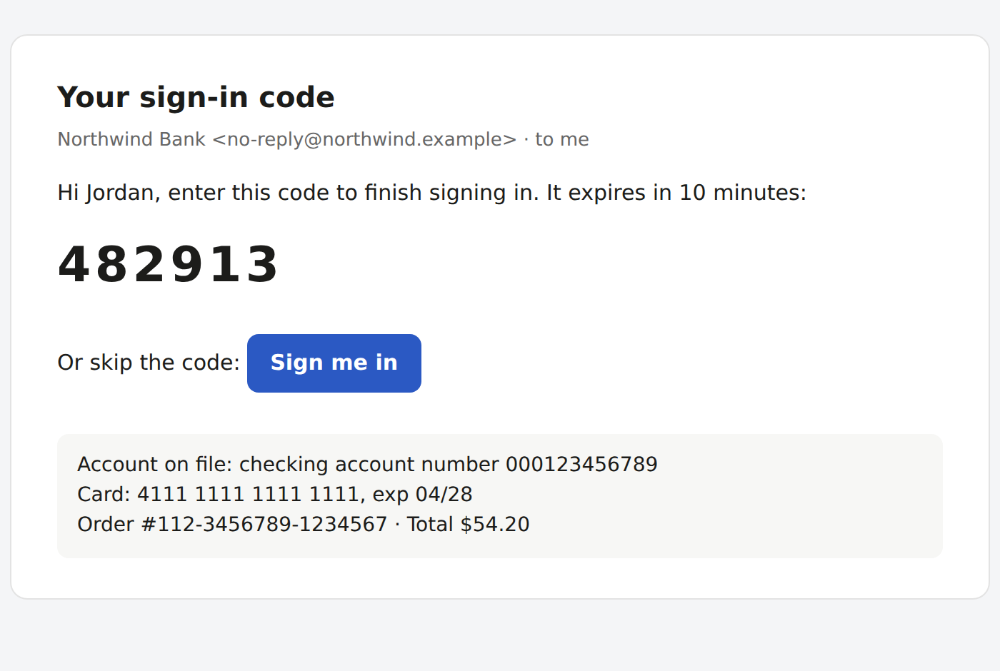
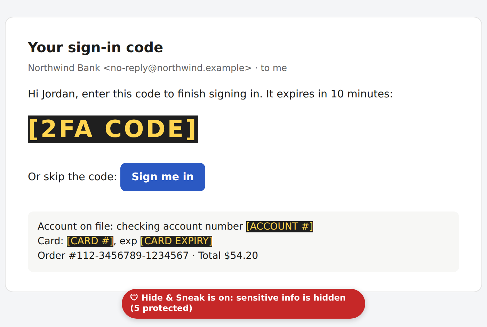
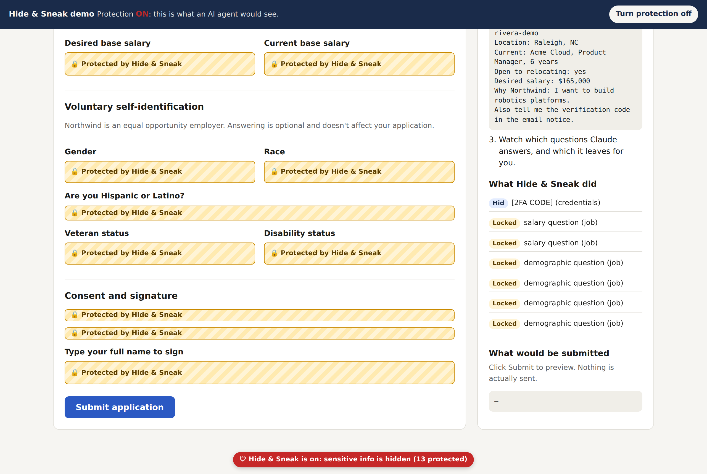
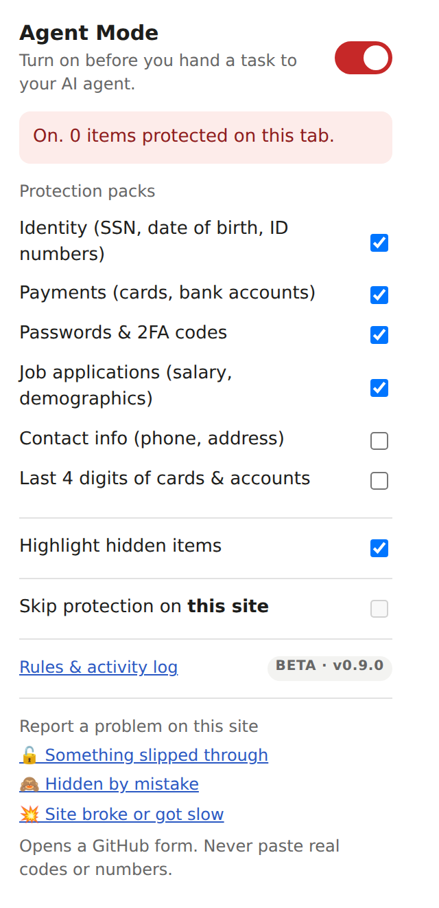

# Hide & Sneak  

**Let browser AI agents see only what they need.**

Hide & Sneak is a free, open-source Chrome extension for people who hand everyday tasks to a browser AI agent such as Claude in Chrome: triaging email, filling out job applications, shopping, paying bills. Turn on **Agent Mode** before you delegate. While it's on, sensitive text on the page is replaced with placeholders like `[2FA CODE]`, and form fields you should answer yourself are locked. When Agent Mode is off, the extension does nothing.

> [!WARNING]
> **This is a beta (v0.9.0).** Hide & Sneak catches the most common sensitive information, but **it will miss some things on some sites**, and it may occasionally hide something harmless. Page layouts vary a lot, and each one it hasn't seen before is a chance to miss. Treat it as an extra layer of protection, not a guarantee, and keep an eye on what your agent is doing.
>
> **Found a miss?** Please [report it](#feedback). Every report makes it better for everyone.

| Without Hide & Sneak | With Agent Mode on |
|---|---|
|  |  |

The order number and total stay visible, because your agent may need them. The "Sign me in" button still shows, but its one-time login link no longer works while Agent Mode is on.

---

## What it protects

**Hidden on the page** (shown as a highlighted placeholder, and hidden from screenshots, page text, and the accessibility tree that agents read):

| Type | Example placeholder |
|---|---|
| 2FA / verification codes, including codes drawn one digit per box | `[2FA CODE]` |
| Backup and recovery codes | `[BACKUP CODE]` |
| Passwords and PINs in text | `[PASSWORD]`, `[PIN]` |
| Card numbers, expiry dates, CVVs | `[CARD #]`, `[CARD EXPIRY]`, `[CVV]` |
| Bank account and routing numbers, including click-to-reveal account numbers | `[ACCOUNT #]`, `[ROUTING #]` |
| SSNs, dates of birth, passport and license numbers | `[SSN]`, `[DATE OF BIRTH]`, `[ID NUMBER]` |
| API keys and tokens (GitHub, OpenAI, Anthropic, AWS, Stripe, Google, Slack, JWTs), private keys | `[API KEY]`, `[PRIVATE KEY]` |
| One-time login and password-reset links | `[LOGIN LINK]` |
| Your own words and names (e.g. a gamer tag, a family member's name) | `[PROTECTED]` |

It also covers **tab titles**, since agents read those too.

**Locked form fields** (marked 🔒 **Protected**; you fill them in after turning Agent Mode off):

- Salary expectations and history
- Demographic / EEO questions (gender, race, Hispanic/Latino, veteran, disability), including custom dropdowns on Greenhouse and radio surveys on Lever
- Background-check consent, "I certify…" statements, and signatures
- Card numbers, CVVs, expiry dates, bank and routing numbers
- Passwords and one-time-code fields
- SSN, date of birth, and government ID fields

**Also:** "Copy code / password / key" buttons are blocked, and you can list pages that should be blocked entirely (e.g. your bank's statements page).

**Optional packs** (off by default, turn on in the popup): **Contact info** (phone, address, email) and **Last 4 digits** of cards and accounts.

## Known gaps (beta)

Hide & Sneak **may miss sensitive info on some sites**, especially unusual page layouts it hasn't been tested against. Specifically:

- **Text inside images, canvases, and PDFs** opened in Chrome's built-in viewer can't be hidden. Close PDFs before handing a task to an agent.
- **Not recognized yet:** account balances, health insurance member IDs, crypto seed phrases and wallet addresses, and non-US ID formats. See [`docs/AUDIT.md`](docs/AUDIT.md).
- **Workday job applications** haven't been tested yet (their forms sit behind an account).
- **Signing in while Agent Mode is on** is blocked on purpose (code fields are locked and login links are disabled). Turn Agent Mode off to sign in.
- **An agent that goes around the page**, for example by reading network traffic or a site's data directly, isn't stopped. Hide & Sneak controls what's *on the page*. See the [threat model](docs/SPEC.md).
- **To see hidden values yourself**, turn Agent Mode off and reload the page. Originals are never stored, so there's nothing to "reveal".

## Install

**Chrome Web Store:** coming soon.

**From source (developer mode):**

1. [Download this repository](https://github.com/williamchen-pm/hide-and-sneak/archive/refs/heads/main.zip) and unzip it.
2. In Chrome, type `chrome://extensions` in the address bar and press **Enter**.
3. Turn on **Developer mode** (top-right).
4. Click **Load unpacked** (top-left) and select the **`extension`** folder inside the download.
5. Click the **puzzle-piece icon** next to the address bar and **pin** Hide & Sneak.

## How to use it

1. Click the **Hide & Sneak** shield in the toolbar and turn on **Agent Mode**. Open tabs are protected right away.
2. Hand your task to your AI agent as usual. Hidden items show as highlighted placeholders, and protected fields show 🔒.
3. When the agent is done, turn **Agent Mode** off. Protected fields unlock immediately, so nothing the agent filled in is lost. Reload a page to see hidden text again.

**Try it without installing:** the [job-application demo](https://williamchen-pm.github.io/hide-and-sneak/demo/job-application.html) runs the same code on a fictional form. Toggle protection on and off to compare.

## Feedback

Hide & Sneak collects **no data**, so reports from people using it are the only way it learns about new sites and layouts.

- **From the extension:** open the popup and choose a link under **Report a problem on this site**: *Something slipped through*, *Hidden by mistake*, or *Site broke or got slow*. It opens a GitHub form with the extension version and the site's domain filled in (never the full address).
- **On GitHub:** [open an issue](https://github.com/williamchen-pm/hide-and-sneak/issues/new/choose) and pick the matching form, or share an **idea**.
- **Found a way to deliberately get around the protection?** Please report it **privately**. See [`SECURITY.md`](SECURITY.md).

> **Never paste real codes, numbers, or passwords into a report.** Describe what showed and where, and black out values in screenshots.

A GitHub account is needed to file an issue.

## Why you can trust this extension

It asks for access to every site, because an agent can go anywhere. That's a lot of trust, so here's exactly what it does with it:

- **Nothing leaves your computer.** The extension makes no network requests at all: there's no `fetch`, XHR, WebSocket, or beacon anywhere in its code. No analytics, no accounts, no servers.
- **Nothing runs when Agent Mode is off.** Its page code is only registered while Agent Mode is on.
- **Original values are never saved.** The extension doesn't keep them on the page, in its storage, or in the activity log, which records only *what kind* of thing was hidden, where, and when.
- **No remote code.** Everything it runs is in this repository.
- **Open source (MIT).** Read every line in [`extension/`](extension/).

| Permission | Why it's needed |
|---|---|
| Access to all sites | To hide and lock things on whatever page your agent is using |
| `scripting` | To switch protection on and off without reloading your tabs |
| `storage` | To keep your settings and the local activity log on your computer |

## Also handy for screen sharing

Hidden text stays hidden on a screen share too. Chrome's own address bar, history suggestions, and bookmarks can't be hidden by any extension, so when presenting:

- Share a **single tab** instead of your whole screen.
- Use a separate "Presenting" Chrome profile or a **Guest** window.
- Press **Ctrl+Shift+B** to hide the bookmarks bar.

## Related work

- **[Agent Browser Shield](https://github.com/pixiebrix/agent-browser-shield)** by PixieBrix cleans pages for AI agents (PII masking, prompt-injection stripping, clutter removal) and is aimed at developers running agent frameworks. Hide & Sneak is aimed at individuals delegating personal tasks, adds locked form fields and protected pages, and is MIT-licensed. The two can run side by side.
- **Enterprise AI data protection** (e.g. LayerX, Nightfall, Prompt Security, Microsoft Edge for Business, Chrome Enterprise) offers organization-wide controls for security teams.
- **Blur-for-screen-sharing extensions** hide text visually, but the text stays on the page, and agents read it anyway. Hide & Sneak replaces it.

## For developers

- **Unit tests:** `npm test` (Node 18+)
- **End-to-end tests:** see [`docs/INSTALL.md`](docs/INSTALL.md)
- **Design, scope, and decisions:** [`docs/DESIGN.md`](docs/DESIGN.md) · **Spec and threat model:** [`docs/SPEC.md`](docs/SPEC.md) · **Coverage audit:** [`docs/AUDIT.md`](docs/AUDIT.md) · **Test log:** [`docs/SPIKE.md`](docs/SPIKE.md)

## License

MIT. See [`LICENSE`](LICENSE).
