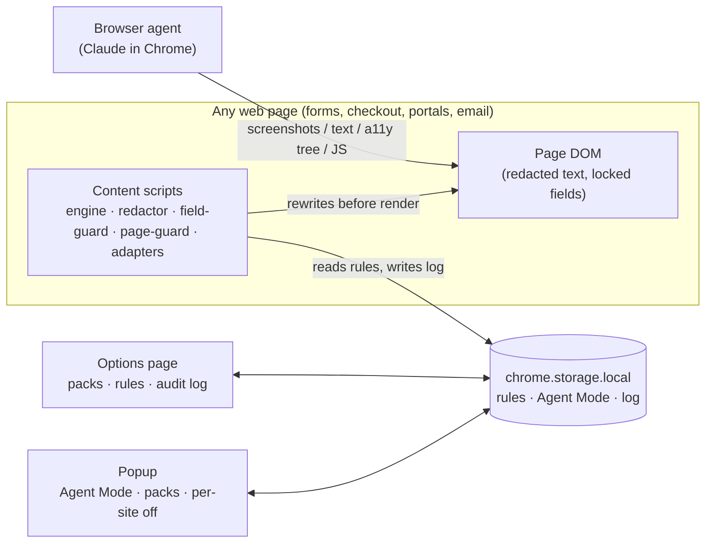

# Hide & Sneak: Design Doc & Scope Tracker

*Owner: William Chen · Last updated: 2026-09-29*

This file is the single view of **what's in scope, what's been decided, and what's been built**. [`SPEC.md`](SPEC.md) holds the detailed requirements. This doc tracks their status.

**Update rule:** any commit that changes a feature's status also updates its row here, and adds a line to the §7 change log.

---

## 1. Snapshot

| | Count |
|---|---|
| Agreed scope items | 34 |
| Built (incl. verified) | 8 |
| In progress | 10 |
| Not started | 16 |
| Open questions | 2 open (Q4, Q5); Q6 partly answered (Workday deferred); Q8 deferred; Q1, Q2, Q3, Q7 answered |
| Deferred / out of scope | 10 |

**Current phase:** Spike + v0 core built (2026-09-29). **Next milestone:** run the spike tests in `SPIKE.md` against real Claude in Chrome, then build the demo pages.

**v0 verified in headless Chromium (e2e test, `tests/e2e/run.js`):** text and attribute redaction; late-loading content; field locks (typing and clicks blocked, script writes cleared, locked fields stripped from submissions, original `value` attribute removed); protected pages; turn-off unlocks without losing filled-in work; nothing injected while off; no original values in the audit log. **Spike run against Claude in Chrome's tools on 2026-09-29 (see `SPIKE.md`):** reading protected across all tools, field locks held against `form_input` and click+type, agent couldn't reach the extension's controls.

**Product stance:** free and open source (MIT), published on both GitHub and the Chrome Web Store, built to be usable every day, not just a demo.

**Use cases covered:** forms and job applications, shopping and checkout, account portals, personal identifiers on any page, email triage, and session review (v1). Research and injection defense, page sections, and a dashboard (v2). Irreversible-action guards (v3). See `SPEC.md` §5.

## 2. Status legend

**Decision status**, meaning whether we've agreed to do it:

| Status | Meaning |
|---|---|
| ✅ Agreed | Decided and in scope for the listed phase |
| 💬 Proposed | Discussed, not yet decided |
| ⏸️ Deferred | Wanted, but blocked or moved to a later phase for a stated reason |
| ⛔ Out of scope | Deliberately not doing, with a reason |

**Build status**, meaning where it stands in code:

| Status | Meaning |
|---|---|
| ⬜ Not started | No code |
| 🟨 In progress | Code exists, not complete |
| 🟩 Built | Feature complete |
| ✔️ Verified | Built and checked against its "done when" test |

## 3. Architecture

**Core principle:** the extension can't intercept the agent. It controls what the page contains when the agent looks at it and which fields it can fill. Sensitive text is replaced, never hidden with CSS; sensitive fields are locked; original values are never stored. When Agent Mode is off, the extension does nothing.

## 4. Scope register

### Spike

| ID | Item | Decision | Build | Spec | Done when |
|---|---|---|---|---|---|
| S-1 | Answer Q1–Q3, Q6, Q7 (debugger API use, how the agent reads pages and fills fields, whether it can operate the popup, ATS markup); Q4 if time allows | ✅ Agreed | 🟨 In progress | §10 | Findings written in `SPIKE.md` |
| S-2 | Prototype text redaction and field locking on a live job application and Gmail | ✅ Agreed | 🟨 In progress | §6.1, §6.2 | Redaction holds across all read methods; agent can't fill a locked field |

### v1

| ID | Item | Use case | Decision | Build | Spec | Done when |
|---|---|---|---|---|---|---|
| V1-1 | Engine: `<all_urls>` content script, Agent Mode gate, pre-render hide, MutationObserver | All | ✅ Agreed | 🟩 Built | §6.1 | Does nothing when off; no content flash when on; meets the 16 ms budget |
| V1-2 | Text + attribute redaction | UC2, UC4 | ✅ Agreed | 🟩 Built | §6.1 | No originals in screenshot, page-text, a11y, or JS reads |
| V1-3 | Pattern rules with checksums (Luhn, ABA) | UC2, UC4 | ✅ Agreed | ✔️ Verified | §6.2 | Unit tests pass, including false-positive cases |
| V1-4 | Field rules: detect, lock, clear, "You fill this one" overlay | UC1, UC2 | ✅ Agreed | 🟩 Built | §6.2 | Agent completes the demo form with every locked field empty |
| V1-5 | Page rules + in-app navigation hooks | UC2, UC3 | ✅ Agreed | 🟩 Built | §6.2 | Protected page never renders, including after in-app navigation |
| V1-6 | Keyword rules | UC4 | ✅ Agreed | 🟨 In progress | §6.2 | Match and block modes tested |
| V1-7 | Gmail adapter: sender + label thread rules | UC5 | ✅ Agreed | ⬜ Not started | §6.2 | Protected threads hidden in the list and message views |
| V1-8 | Protection packs: Identity, Payments, Credentials, Contact, Job applications | UC1–UC4 | ✅ Agreed | 🟩 Built | §6.3 | Each pack toggles independently; fixtures pass |
| V1-9 | Fail-closed fallback per rule | All | ✅ Agreed | 🟨 In progress | §6.2 | Missed targets trigger the fallback and a log entry |
| V1-10 | Popup: manual Agent Mode on/off toggle, badge (on / count / miss), pack toggles, per-site off (no reload on toggle; see decision log) | All | ✅ Agreed | 🟩 Built | §6.4 | State is correct after a reload |
| V1-20 | First-run onboarding page | All | ✅ Agreed | 🟨 In progress | §6.5 | Setup in under 2 minutes with no rule-writing |
| V1-21 | "Test my protection" self-test page | All | ✅ Agreed | ⬜ Not started | §6.5 | Pass/fail per item for the user's current rules; works offline |
| V1-22 | Chrome Web Store listing: privacy disclosure, permission rationale, MIT license | All | ✅ Agreed | ⬜ Not started | §6.7 | Approved and installable |
| V1-23 | Public GitHub repo: LICENSE, README, SECURITY.md, CHANGELOG, tagged releases with packaged .zip | All | ✅ Agreed | 🟨 In progress | §6.7 | Repo public; release .zip matches the store version |
| V1-24 | Store assets: 128×128 icon, 440×280 promo tile, 1–5 screenshots (1280×800) | All | ✅ Agreed | 🟨 In progress | §6.7 | Assets meet Chrome Web Store specs |
| V1-25 | Privacy policy page on GitHub Pages | All | ✅ Agreed | ⬜ Not started | §6.7 | URL live and matches the store's data disclosures |
| V1-26 | Pre-publish checks: original name and icon (R10); personal time and equipment (R11); clean-room vs Agent Browser Shield (R12) | All | ✅ Agreed | 🟨 In progress | §9 | R11 confirmed; name chosen (re-check the store before submitting); icon not yet designed |
| V1-27 | Comparison test vs Agent Browser Shield; publish `COMPARISON.md` | All | ✅ Agreed | ⬜ Not started | §2.3 | Results for all four setups on the three demos, dated, with versions |
| V1-28 | MAIN-world setter hook on locked fields, to close most of the ~400 ms script-write window | UC1, UC2 | ✅ Agreed | ⬜ Not started | §8 | A `javascript_tool` write to a locked field reads back empty immediately |
| V1-11 | Options page: custom rules, JSON import and export | All | ✅ Agreed | 🟨 In progress | §6.4 | Round-trip export and import preserves all rules |
| V1-12 | Audit log (capped; no original values) + table view | UC6 | ✅ Agreed | ✔️ Verified | §6.6 | Test confirms no originals in storage |
| V1-13 | Demo: job application (lead demo) | UC1 | ✅ Agreed | 🟨 In progress | §6.8 | Live on GitHub Pages with an off/on toggle |
| V1-14 | Demo: checkout + saved-cards page | UC2 | ✅ Agreed | ⬜ Not started | §6.8 | Same |
| V1-15 | Demo: inbox | UC4, UC5 | ✅ Agreed | ⬜ Not started | §6.8 | Same |
| V1-16 | Coverage check across demos (`COVERAGE.md`) | All | ✅ Agreed | ⬜ Not started | §6.8, §12 | 90% or more of about 40 seeded items; every miss documented |
| V1-17 | Demo GIF: Claude in Chrome on the job application, protection off vs on | UC1 | ✅ Agreed | ⬜ Not started | §6.8 | Embedded in the README |
| V1-18 | README with threat model, limits, and permission rationale | All | ✅ Agreed | ⬜ Not started | §8, R8 | Threat model matches the shipped behavior |

### v2

| ID | Item | Use case | Decision | Build | Spec |
|---|---|---|---|---|---|
| V2-1 | Prompt-injection flagging on any page + banner | UC7 | ✅ Agreed | ⬜ Not started | §5 |
| V2-2 | Section rules + point-and-click picker | UC8 | ✅ Agreed | ⬜ Not started | §6.2 |
| V2-3 | Audit dashboard | UC9 | ✅ Agreed | ⬜ Not started | §6.6 |
| V2-4 | Pre-submit check for `[TOKEN]` strings in outgoing text | R3 | ✅ Agreed | ⬜ Not started | §9 |
| V2-5 | Optional Automatic Agent Mode: protect only Claude in Chrome's tab group | All | ✅ Agreed, pending Q4 | ⬜ Not started | §6.4 |

### v3 and later

| ID | Item | Decision | Build | Reason |
|---|---|---|---|---|
| V3-1 | Action rules (Place order, Submit, Transfer, Send, Delete) | ⏸️ Deferred to v3 | ⬜ | Weakest protection: a script `.click()` gets around it |
| V3-2 | More site adapters (Outlook web, Google Drive) | ⏸️ Deferred to v3 | ⬜ | Standards-based rules cover most sites first |
| V3-4 | Site-blocklist policy generator | ⏸️ Deferred; likely drop | ⬜ | Q1 confirmed Claude uses the debugger API, so Chrome 155+ policy would be all-or-nothing. Drop if Q8 shows Chrome's per-extension Site access works. |

### Out of scope

| Item | Reason |
|---|---|
| Guaranteed prevention | Defense in depth only |
| Click-to-reveal while Agent Mode is on | The agent can click too |
| Cloud sync, accounts, telemetry, network calls | No data leaves the machine |
| ML classifiers | Rules keep behavior explainable and testable |
| Enterprise fleet management | Target user is an individual |
| Site-blocklist policy in v1 | See V3-4 |
| Monetization (paid tier, ads, accounts) | Free and open source; the goal is a usable tool and a portfolio piece |

## 5. Decision log

| Date | Decision | Rationale |
|---|---|---|
| 2026-09-29 | Position as an open-source personal take on an existing category, not a new idea | Enterprise vendors (LayerX, Nightfall, Prompt Security, Edge for Business, Chrome Auto Browse DLP) already build this |
| 2026-09-29 | ~~Gmail is the first target~~ Superseded same day: rescoped to common agent tasks, with Gmail as one adapter | Forms, shopping, portals, and research are as common as email, and a job-application demo is more relatable to hiring managers |
| 2026-09-29 | Add field rules (lock + clear + overlay) in v1 | Covers the write side: forms, job applications, checkout |
| 2026-09-29 | Protection packs by use case (Identity, Payments, Credentials, Contact, Job applications) | Users turn on protections, not regexes |
| 2026-09-29 | Content scripts on `<all_urls>`, inert when Agent Mode is off; no network permissions | The agent can go anywhere; the trust cost is handled by being open source and explaining it in the README |
| 2026-09-29 | Job application is the lead demo | Every hiring manager recognizes it |
| 2026-09-29 | Replace text in the DOM; never hide it with CSS | CSS-hidden text is still readable by agent JavaScript |
| 2026-09-29 | Never store original values (page, DOM, or log) | Anything stored can be read |
| 2026-09-29 | No click-to-reveal; Agent Mode off plus reload is the only way to see originals | The agent can click |
| 2026-09-29 | Site blocklist policy generator deferred from v1 | Chrome 155 (stable 2026-10-06) makes `runtime_blocked_hosts` disable `chrome.debugger` on all sites |
| 2026-09-29 | Page rules in v1; section picker in v2; action rules in v3 | Ordered by cost versus reliability; action rules are the weakest protection |
| 2026-09-29 | Free and open source (MIT); published on the Chrome Web Store and GitHub | Goal is a tool people actually use plus a portfolio piece, not revenue |
| 2026-09-29 | Automatic Agent Mode (Claude's tab group only) moved from v3 to v1, pending Q4 | Remembering to flip a toggle is the weakest point of the UX; Claude's dedicated tab group makes auto-detection plausible |
| 2026-09-29 | Publish on both GitHub and the Chrome Web Store (confirmed by owner) | Installable for real users; source is open for inspection |
| 2026-09-29 | No "Claude" or Anthropic branding in the name or icon | Avoids trademark and impersonation-policy problems at store review |
| 2026-09-29 | Name: **Need to Know** (replaces the placeholder "AgentShield"); superseded by Hide & Sneak, see below | "AgentShield" is used by several AI-agent security products, and PixieBrix's "Agent Browser Shield" is in the same category. "Need to know" was a familiar security principle and plain English. |
| 2026-09-29 | Renamed to **Hide & Sneak** (owner's pick from a shortlist of punny names) | Memorable and playful. Web search found no Chrome extension or app with the name (not a trademark clearance). Always pair it with a plain subtitle in the store listing, since "sneak" alone could read as evasive to a reviewer. Code identifiers renamed (`HNSDetect`, `data-hns`). |
| 2026-09-29 | Position against PixieBrix Agent Browser Shield as related work; clean-room build | Closest prior art (read-side PII masking + injection stripping). Differentiators: individual UX, field locks, page rules, audit log, MIT license. |
| 2026-09-29 | Lead positioning with write-side control and personal policy, not ease of use | Ease of use is the easiest gap for a competitor to close; field locks and user-defined rules are structural |
| 2026-09-29 | Test Agent Browser Shield hands-on before publishing any comparison | Claims so far are from their GitHub page and launch post only |
| 2026-09-29 | Register content scripts only while Agent Mode is on (`scripting` permission); drop `tabs` permission | "Does nothing when off" is literally true: nothing is injected. Smaller permission set for store review. |
| 2026-09-29 | Turning on injects into open tabs without reloading; turning off unlocks fields in place without reloading | Reloading on turn-off would wipe the form the agent just filled, which is the whole job-application use case. Hidden text stays hidden until a manual reload, since originals are never stored. |
| 2026-09-29 | Locked fields: clear value **and** the `value`/`checked`/`selected` attributes; clear on input events, a 400 ms sweep, and before submit; strip from submitted form data | e2e test found the original still readable in the HTML attribute, and a script write readable until the next sweep |
| 2026-09-29 | Radio/checkbox question text: climb ancestors only while they contain no other fields, then read the label just before | First version read the whole form and locked an unrelated "authorized to work" question because the form mentioned salary |
| 2026-09-29 | Lock markers cover the whole control for comboboxes and tiny inputs; radio/checkbox groups share one marker | Real Greenhouse EEO questions are React-Select widgets with a 3 px input; the per-option markers overlapped on grouped radios |
| 2026-09-29 | Demo pages run the real engine through a small `chrome.*` shim (`demo/demo-shim.js`) instead of a separate demo implementation | The demo can't drift from what the extension actually does |
| 2026-09-29 | Engine "already running" guard uses a DOM attribute, not a window flag | The extension (isolated world) and the demo page (main world) don't share `window`; both engines ran when the extension was on |
| 2026-09-29 | Whole-site blocking is out of the MVP; README points users to Claude in Chrome's own site permissions (Decline / approved sites) | Owner call. MVP protects parts of pages (text, fields) plus specific pages via page rules, which is where the gap is; whole-site blocking already exists in Claude's settings |
| 2026-09-29 | No typed-phrase confirmation needed to turn Agent Mode off | Spike Test 4: the agent's tools can't reach the extension's popup or options page |
| 2026-09-29 | Field locks must clear values after writes, not rely on `readonly`/`disabled` | Spike Test 3: `form_input` writes straight into read-only fields |
| 2026-09-29 | Manual Agent Mode toggle is the v1 design; Automatic mode moved to v2 as optional | Owner confirmed manual on/off is acceptable; removes Q4 as a v1 dependency |
| 2026-09-29 | Add onboarding and a "Test my protection" page to v1 | Users need a way to confirm it works before trusting it |
| 2026-09-29 | Prompt-injection flagging applies to all pages, not just email (v2) | Research on untrusted sites is a primary agent use case |
| 2026-09-29 | Section rules fail closed by default | A silent miss is worse than an over-protected page |
| 2026-09-29 | Coverage reported as a check on seeded test data, not a statistical claim | Honest framing |
| 2026-09-29 | Design doc lives in the repo at `docs/DESIGN.md` | Status updates ship in the same commits as the code |

## 6. Open questions

| ID | Question | Blocks | Status | Answer |
|---|---|---|---|---|
| Q1 | Does Claude in Chrome use `chrome.debugger` (CDP)? | V3-4 | **Answered 2026-09-29** | Yes (v1.0.94 permissions list "Access the page debugger backend"). R1 confirmed: per-site `runtime_blocked_hosts` can't be used. Input arrives as trusted CDP events, which the field-lock overlays block in the e2e test. |
| Q8 | Does Chrome's per-extension Site access ("On specific sites") keep Claude off unlisted sites? | V3-4 | Deferred (not needed for MVP) | Test 1b in `SPIKE.md`, optional |
| Q2 | How does the agent read pages: screenshots, a11y tree, page text, JS? | S-2, V1-2 | **Answered 2026-09-29** | All of them. `read_page` returns non-visible elements by default, including `display:none` text, `aria-label`, and `title`. Screenshots add canvas/image text. CSS hiding gives zero protection. |
| Q3 | Can the agent operate this extension's popup or options page? | V1-10 | **Answered 2026-09-29** | No. navigate, window.open, fetch, and chrome.runtime were all blocked; the toolbar is outside the agent's viewport. |
| Q4 | Can Claude in Chrome's tab group be identified reliably (title/color, drag in and out)? | V2-5 (optional) | Partly answered | Release notes confirm Claude uses a dedicated tab group. Identification method still to test. |
| Q5 | Does Gmail's reply quoting use the DOM or its internal model? | V2-4 | Open | — |
| Q6 | How do Greenhouse, Lever, and Workday mark up EEO, salary, and attestation questions? | V1-4, V1-8 | **Answered for Greenhouse and Lever (2026-09-29)**; Workday deferred (needs an account) | Greenhouse uses React-Select comboboxes (3 px input in a 600 px control): v0 under-covered them, now fixed. Lever uses radio-group surveys: locked correctly. |
| Q7 | How does the agent fill fields: simulated typing, `insertText`, or setting `.value` by script? | V1-4 | **Answered 2026-09-29** | Two paths: click + type (trusted CDP key events) and `form_input` (script write from another world + untrusted `input` event), which bypasses `readonly`. With Agent Mode on, both were held on the locked field. A bare script write is readable for up to ~400 ms before it's cleared. |

## 7. Change log

| Date | Change |
|---|---|
| 2026-09-29 | Spec v1 written (`SPEC.md`) |
| 2026-09-29 | Spec v2: added page, section, and action rules; fail-closed; risks R6 and R7 |
| 2026-09-29 | Design doc created |
| 2026-09-29 | Spec v3: rescoped from Gmail-only to common agent tasks; added field rules, protection packs, job-application and checkout demos, Q6–Q7, R8–R9 |
| 2026-09-29 | Design doc updated to match spec v3 |
| 2026-09-29 | Spec v4: free and open source, Chrome Web Store distribution, Automatic Agent Mode, onboarding, self-test |
| 2026-09-29 | Spec v4.1: manual Agent Mode in v1; Automatic mode moved to v2 (optional) |
| 2026-09-29 | Added GitHub and Chrome Web Store release checklists, risks R10–R11, and items V1-23 to V1-26 |
| 2026-09-29 | R11: owner confirmed personal time and equipment |
| 2026-09-29 | Renamed placeholder to Need to Know; added prior art (§2.1 of spec) and risk R12 |
| 2026-09-29 | Spec v4.2: positioning (§2.2), comparison test plan (§2.3), item V1-27 |
| 2026-09-29 | v0 built: detection core (13 unit tests passing), content engine, popup, options/log, icons, spike probe page, e2e test, INSTALL.md |
| 2026-09-29 | Renamed Need to Know → Hide & Sneak across docs, extension UI, and code identifiers |
| 2026-09-29 | Spike Test 1 done: Claude in Chrome uses the debugger API (Q1 answered, R1 confirmed); added Q8 (Chrome per-extension Site access) |
| 2026-09-29 | Spike Tests 2, 3, 4 run with Claude in Chrome's tools: Q2, Q3, Q7 answered; added V1-28 (MAIN-world setter hook) |
| 2026-09-29 | MVP scope confirmed: no whole-site blocking; Q8 / Test 1b deferred |
| 2026-09-29 | Q6: inspected real Greenhouse and Lever forms; fixed combobox coverage and group markers; built `demo/job-application.html` (runs the real engine); added ATS fixture + demo e2e test |
